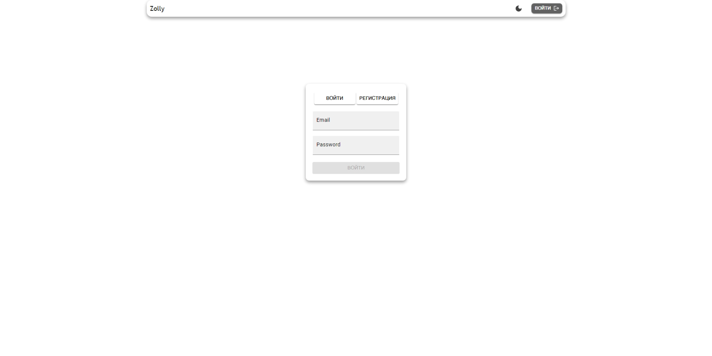

# Zolly

Zolly - индивидуальный проект, где пользователи могут создавать, редактировать и удалять свои посты с помощью IU кнопок. Веб-приложение поддерживает многопользовательскую систему с авторизацией, а также включает функции персонализации, такие как выбор темы сайта и уникальные аватары.

## Технологии:

- React
- Redux toolkit
- JavaScript
- Node js
- express
- postgreSQL
- Prisma
- material UI
- TypeScript

## Скриншоты

#### подписки

#### страница полного поста

#### вход и регистрация

